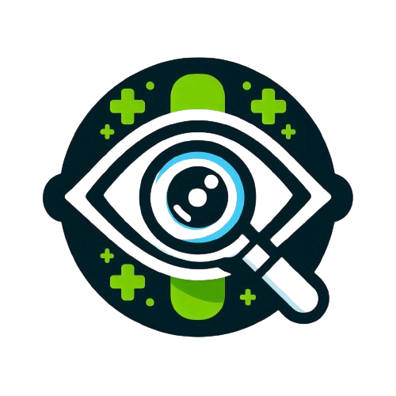

<p align="center">
  
</p>

<h1 align="center">Diabetic Retinopathy Detection</h1>
<p align="center"><b>A Streamlit app that screens retinal fundus images for diabetic retinopathy using a scikit-learn classifier.</b></p>

<p align="center">
  
  
  
</p>

Diabetic retinopathy is retinal damage caused by high blood sugar, and it's
a leading cause of preventable blindness if caught late. This app takes a
retinal fundus photo, runs it through a trained classifier, and flags
whether it shows signs of diabetic retinopathy, along with basic
follow-up guidance.

## How it works

1. Upload a retinal image (`jpg`/`png`) in the Streamlit UI.
2. The image is resized to 224x224 and normalized.
3. `diabetic_retinopathy_model.pkl`, a scikit-learn classifier trained on
   labeled retinal images, predicts a diagnosis.
4. The app shows a detected / not-detected result with basic medical
   guidance for either case.

The training labels (`labels.csv`) use the standard 5-class DR severity
scale (No DR, Mild, Moderate, Severe, Proliferative DR); the current UI
collapses that to a binary detected/not-detected result.

**Note:** the training script that produced the `.pkl` isn't included in
this repo, only the trained model artifact and `app.py` for inference.
The dataset used follows the same class layout as Kaggle's
[APTOS 2019 Blindness Detection](https://www.kaggle.com/c/aptos2019-blindness-detection)
dataset; the raw images aren't checked into this repo to keep it a
reasonable size to clone, `labels.csv` alone documents the label
distribution.

## Running it

```bash
pip install -r requirements.txt
streamlit run app.py
```

Then open http://localhost:8501.

## Repository layout

```
app.py                            Streamlit app: upload, predict, display result
diabetic_retinopathy_model.pkl    trained scikit-learn classifier
labels.csv                        training label reference (image id -> DR stage 0-4)
logo.png                          app icon / header image
```

## License

MIT. See [LICENSE](LICENSE) for details.